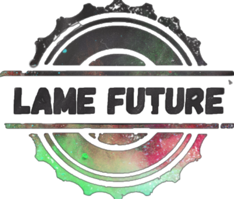

<h1>Lame Future</h1>

<h3 align="center">made by <a href="https://github.com/VA-CYBER-DOC" target="_blank">VA</a>  and <a href="https://github.com/NeMoSemi" target="_blank">Nemo_Semi</a></h3>
<a>

Сюжет: Игра представляет из себя симулятор грузчика выполненный в виде визуальной новеллы. В ходе игры нам предстоит доставлять грузы и узнавать секреты, которые скрывает от нас наша компания

Код:

1. Реализован класс MakeButton, от него наследуются все имеющиеся в главном меню и настройках кнопки

2. Созданны настройки и ползунки громкости с возможностью изменения 3-х типов громкости

3. Созданна система введения подсчёта и изменения данных(в том числе подсчёт очко в конце игры) путём взаимодействия с 2 функциями: know_var и change_var

4. Реализован движок 'pgte_engine' позволяющий содавать любые типы визуальных новелл, а также возможности выбора в них вариантов ответа, влияющих на дальнейщий ход игры

5. Создана миниигра представляющая из себя полосу с препятствиями

6. Созданны титры со списком создателей игры(их всего 2=)) и система подсчёта очков по завершению игры

</a>